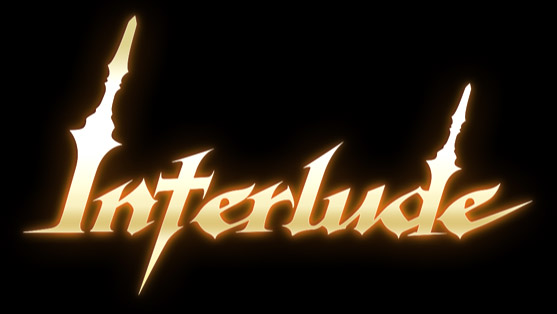

# Interlude Theme

> _A theme to be used on websites built with [Hugo](https://gohugo.io/)._

Theme used on my [my braindump](https://github.com/samuelematias/samuelematias.github.io).
 
Currently, largely copied from [ayrat555/cortex-dark](https://github.com/ayrat555/cortex-dark).

## Author

<!-- prettier-ignore -->
<table>
  <tr>
    <td align="center"><a href="https://twitter.com/samuelematias"> <b>Samuel Matias</b></a> <a href="https://www.linkedin.com/in/samuelematias/"title="Code">💻</a><a href="https://linktr.ee/samuelematias"title="Design"> 🎨</a></td></td>
</table>
